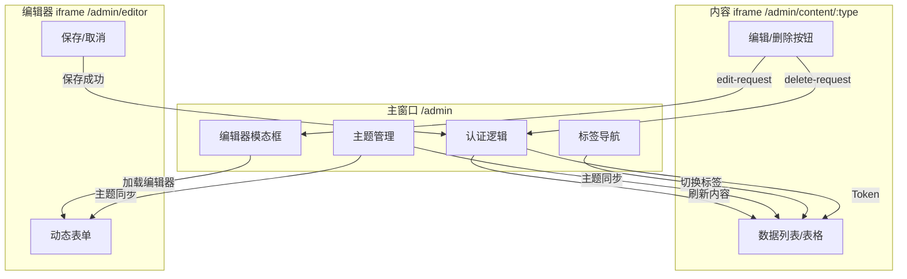
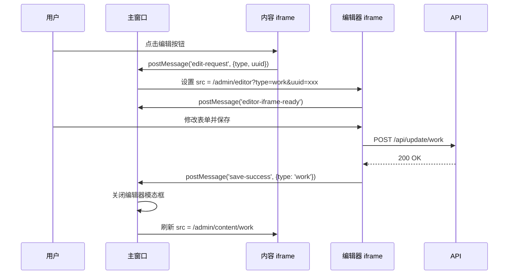

# Admin 多 iframe 架构

VOCArchive 的管理后台采用三层 iframe 架构，实现页面隔离和灵活的内容加载。

## 为什么使用 iframe

### 传统 SPA 的问题

在典型的 SPA（单页应用）中，管理后台可能会遇到：
- **状态管理复杂** - 多个数据表的状态互相干扰
- **路由耦合** - 列表、编辑器共享路由状态
- **内存泄漏风险** - 大量数据和组件实例常驻内存 

### iframe 的优势

- ✅ **完全隔离** - 每个 iframe 有独立的 JavaScript 上下文和 DOM
- ✅ **按需加载** - 切换标签时重新加载内容，释放内存
- ✅ **简化状态管理** - 每个 iframe 独立管理自己的状态
- ✅ **SSR 友好** - 每个页面可以独立使用服务端渲染
- ✅ **渐进增强** - 可以逐步迁移到更现代的架构

### 权衡

- ⚠️ 跨 iframe 通信需要 postMessage
- ⚠️ 每个 iframe 独立加载资源（但可以利用浏览器缓存）

## 三层架构



### 1. 主窗口（/admin）

**职责**：
- 用户认证（TOTP 登录）
- 标签导航（work、creator、tag 等）
- 主题切换
- 管理编辑器模态框

**关键文件**：
- `src/app/pages/admin.tsx` - 主页面 SSR
- `public/admin/js/main.js` - 主逻辑
- `public/admin/js/core/auth.js` - 认证模块
- `public/admin/js/ui/theme.js` - 主题管理

**认证流程**：

```typescript
// 用户输入 TOTP 码
const authCode = '123456';

// 调用认证 API
const response = await fetch('/api/auth/login', {
    method: 'POST',
    body: JSON.stringify({ code: authCode })
});

const { token } = await response.json();

// 存储 JWT Token
localStorage.setItem('vocarchive_jwt_token', token);

// 显示管理面板
showAdminPanel();
```

**标签切换**：

点击标签时，更新内容 iframe 的 `src`：

```javascript
function loadContent(type) {
    const contentIframe = document.getElementById('content');
    const token = localStorage.getItem('vocarchive_jwt_token');
    contentIframe.src = `/admin/content/${type}?token=${token}`;
}
```

### 2. 内容 iframe（/admin/content/:type）

**职责**：
- 展示数据列表（作品、创作者、标签等）
- 提供编辑/删除按钮
- 发送操作请求到主窗口

**关键文件**：
- `src/app/pages/admin-content.tsx` - 内容页面 SSR
- `src/app/admin/data-loader.ts` - 数据加载逻辑
- `public/admin/js/iframe-client.js` - iframe 内客户端脚本

**数据加载**（SSR）：

```typescript
// admin-content.tsx
export const AdminContentPage = async (props: { type: string }) => {
    const db = createDrizzleClient(c.env.DB);
    const contentData = await loadAdminData(db, props.type);

    return (
        <html>
            <body>
                {/* 渲染数据表格/卡片 */}
                <DataTable data={contentData} type={props.type} />
            </body>
        </html>
    );
};
```

**按钮事件处理**：

iframe 内的按钮通过 postMessage 通知主窗口：

```javascript
// iframe-client.js
document.addEventListener('click', (e) => {
    if (e.target.classList.contains('edit-button')) {
        const uuid = e.target.dataset.uuid;
        const type = e.target.dataset.target;

        // 发送编辑请求到主窗口
        window.parent.postMessage({
            type: 'edit-request',
            target: type,
            uuid: uuid
        }, '*');
    }

    if (e.target.classList.contains('delete-button')) {
        const uuid = e.target.dataset.uuid;
        const type = e.target.dataset.target;

        // 发送删除请求到主窗口
        window.parent.postMessage({
            type: 'delete-request',
            target: type,
            uuid: uuid
        }, '*');
    }
});
```

### 3. 编辑器 iframe（/admin/editor）

**职责**：
- 显示动态表单（新建/编辑）
- 处理表单提交
- 通知主窗口保存结果

**关键文件**：
- `src/app/pages/admin-editor.tsx` - 编辑器页面 SSR
- `src/app/pages/components/admin/form/form-config.ts` - 表单配置
- `src/app/pages/components/admin/form/form-renderer.tsx` - 表单渲染器

**加载编辑器**：

主窗口收到 `edit-request` 消息后，加载编辑器 iframe：

```javascript
// main.js
window.addEventListener('message', (event) => {
    if (event.data.type === 'edit-request') {
        const { target, uuid } = event.data;
        loadEditorForEdit(editorIframe, editorModal, target, uuid);
    }
});

function loadEditorForEdit(iframe, modal, type, uuid) {
    const token = localStorage.getItem('vocarchive_jwt_token');
    iframe.src = `/admin/editor?type=${type}&uuid=${uuid}&token=${token}`;
    modal.classList.remove('hidden');
}
```

**表单提交**：

编辑器 iframe 内的表单提交逻辑：

```javascript
async function handleFormSave() {
    const formData = collectFormData();

    const response = await fetch(`/api/update/${type}`, {
        method: 'POST',
        headers: {
            'Authorization': `Bearer ${token}`
        },
        body: JSON.stringify(formData)
    });

    if (response.ok) {
        // 通知主窗口保存成功
        window.parent.postMessage({
            type: 'save-success',
            target: type
        }, '*');
    }
}
```

主窗口收到 `save-success` 后，关闭编辑器并刷新内容：

```javascript
window.addEventListener('message', (event) => {
    if (event.data.type === 'save-success') {
        closeEditor(editorIframe, editorModal);
        loadContent(currentTab); // 刷新内容 iframe
    }
});
```

## postMessage 通信协议

### 消息类型

**iframe → 主窗口**：

| 类型 | 数据 | 说明 |
|-----|------|------|
| `edit-request` | `{ target, uuid }` | 请求编辑项目 |
| `delete-request` | `{ target, uuid }` | 请求删除项目 |
| `create-request` | `{ target }` | 请求创建项目 |
| `save-success` | `{ target }` | 保存成功 |
| `editor-iframe-ready` | `{ type, uuid }` | 编辑器加载完成 |

**主窗口 → iframe**：

| 类型 | 数据 | 说明 |
|-----|------|------|
| `theme-change` | `{ theme }` | 主题切换 |
| `refresh-content` | - | 刷新内容 |
| `remove-row` | `{ uuid }` | 移除指定行 |

### 示例：完整的编辑流程



## 主题同步机制

主题状态存储在主窗口的 `localStorage`：

```javascript
// 主窗口
const theme = localStorage.getItem('vocarchive_theme') || 'light';
document.documentElement.setAttribute('data-theme', theme);
```

主题切换时，通知所有 iframe：

```javascript
function toggleTheme() {
    const newTheme = currentTheme === 'light' ? 'dark' : 'light';
    localStorage.setItem('vocarchive_theme', newTheme);
    document.documentElement.setAttribute('data-theme', newTheme);

    // 通知内容 iframe
    contentIframe.contentWindow.postMessage({
        type: 'theme-change',
        theme: newTheme
    }, '*');

    // 通知编辑器 iframe（如果打开）
    if (editorModal.classList.contains('visible')) {
        editorIframe.contentWindow.postMessage({
            type: 'theme-change',
            theme: newTheme
        }, '*');
    }
}
```

iframe 内监听主题变更：

```javascript
// iframe-client.js
window.addEventListener('message', (event) => {
    if (event.data.type === 'theme-change') {
        document.documentElement.setAttribute('data-theme', event.data.theme);
    }
});
```

## Token 传递

JWT Token 通过 URL 参数传递到 iframe，避免跨域 Cookie 问题：

```javascript
// 主窗口
const token = localStorage.getItem('vocarchive_jwt_token');
contentIframe.src = `/admin/content/work?token=${token}`;
```

iframe 内的 API 请求使用该 Token：

```javascript
// iframe 内
const urlParams = new URLSearchParams(window.location.search);
const token = urlParams.get('token');

fetch('/api/delete/work', {
    method: 'POST',
    headers: {
        'Authorization': `Bearer ${token}`
    },
    body: JSON.stringify({ work_uuid: uuid })
});
```

服务端支持从 URL 参数读取 Token：

```typescript
// src/app/index.tsx
const adminContentMiddleware = async (c, next) => {
    // 优先检查 URL 参数
    const tokenFromQuery = c.req.query('token');

    let token = tokenFromQuery;
    if (!token) {
        // 回退到 Authorization header
        const authHeader = c.req.header('Authorization');
        if (authHeader?.startsWith('Bearer ')) {
            token = authHeader.substring(7);
        }
    }

    if (!token) {
        return c.html(<UnauthorizedPage />, 401);
    }

    // 验证 Token
    const payload = await verify(token, secretKey);
    c.set('jwtPayload', payload);
    return await next();
};
```

## 性能优化

### 1. 资源缓存

所有静态资源（CSS、JS）通过浏览器缓存共享，避免重复加载。

### 2. 按需加载

切换标签时，旧的 iframe 内容被卸载，释放内存。

### 3. 懒加载编辑器

编辑器 iframe 仅在需要时加载，不占用初始资源。

## 限制和注意事项

- **跨域限制**：所有 iframe 必须同源（同域名）
- **postMessage 安全**：生产环境应验证 `event.origin`
- **内存管理**：频繁切换标签会重新加载 iframe，可能影响用户体验
- **调试困难**：多个 iframe 增加调试复杂度，需要分别打开 DevTools

## 未来改进

- 考虑使用 Web Components 替代 iframe
- 引入更轻量的状态管理（如 Zustand）
- 支持 iframe 预加载和缓存
