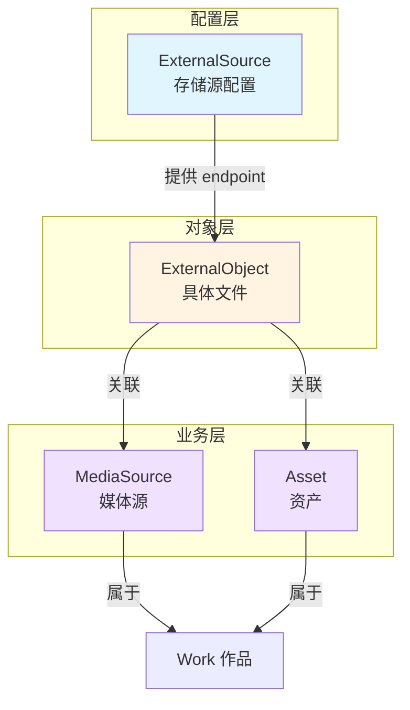

# 外部存储抽象

VOCArchive 的媒体文件不存储在 D1 数据库中，而是通过外部存储抽象层管理。

## 为什么需要抽象层

### 直接存储 URL 的问题

早期版本直接在 `media_source` 和 `asset` 表中存储文件 URL：

```typescript
// ❌ 旧设计
export const mediaSource = sqliteTable('media_source', {
    id: integer('id').primaryKey(),
    url: text('url').notNull(), // 直接存储 URL
    // ...
});
```

**问题**：
1. **URL 变更困难** - 更换存储服务需要更新所有记录
2. **无法统一管理** - 缺少存储源的配置管理
3. **无负载均衡** - 单一 URL 无法实现多节点访问
4. **迁移复杂** - 无法批量迁移文件到新存储

### 抽象层的优势

- ✅ **统一配置** - 集中管理存储源配置
- ✅ **灵活迁移** - 更换存储服务只需更新配置
- ✅ **负载均衡** - 支持多节点 IPFS Gateway
- ✅ **多存储支持** - 原始 URL、IPFS、S3 等
- ✅ **独立管理** - 文件对象独立于媒体/资产

## 三层架构



### 1. ExternalSource（存储源配置）

定义存储服务的配置信息。

**Schema**：

```typescript
export const externalSource = sqliteTable('external_source', {
    id: integer('id').primaryKey({ autoIncrement: true }),
    uuid: text('uuid').notNull().unique(),
    type: text('type', { enum: ['raw_url', 'ipfs'] }).notNull(),
    name: text('name').notNull(),
    endpoint: text('endpoint').notNull(),
    isIPFS: integer('isIPFS', { mode: 'boolean' }).notNull().default(false),
});
```

**字段说明**：
- `type`: 存储类型（`raw_url` 或 `ipfs`）
- `name`: 存储源名称（如 "Cloudflare IPFS Gateway"）
- `endpoint`: 访问端点（如 `https://cloudflare-ipfs.com/ipfs/`）
- `isIPFS`: 是否为 IPFS 存储

**示例数据**：

```json
{
  "type": "ipfs",
  "name": "Cloudflare IPFS Gateway",
  "endpoint": "https://cloudflare-ipfs.com/ipfs/",
  "isIPFS": true
}
```

### 2. ExternalObject（文件对象）

表示存储在外部的具体文件。

**Schema**：

```typescript
export const externalObject = sqliteTable('external_object', {
    id: integer('id').primaryKey({ autoIncrement: true }),
    uuid: text('uuid').notNull().unique(),
    external_source_id: integer('external_source_id').notNull().references(() => externalSource.id, {
        onDelete: 'cascade'
    }),
    object_id: text('object_id').notNull(), // IPFS CID 或文件路径
    mime_type: text('mime_type').notNull(),
    file_size: integer('file_size'),
});
```

**字段说明**：
- `external_source_id`: 关联到存储源
- `object_id`: 存储标识符
  - IPFS: CID（如 `Qm...`）
  - 原始 URL: 文件路径或完整 URL
- `mime_type`: MIME 类型（如 `audio/mpeg`）
- `file_size`: 文件大小（字节）

**示例数据**：

```json
{
  "external_source_id": 1,
  "object_id": "QmYwAPJzv5CZsnA625s3Xf2nemtYgPpHdWEz79ojWnPbdG",
  "mime_type": "audio/mpeg",
  "file_size": 5242880
}
```

### 3. 关联表

将 ExternalObject 关联到业务实体。

**MediaSource ↔ ExternalObject**：

```typescript
export const mediaSourceExternalObject = sqliteTable('media_source_external_object', {
    media_source_id: integer('media_source_id').notNull().references(() => mediaSource.id, {
        onDelete: 'cascade'
    }),
    external_object_id: integer('external_object_id').notNull().references(() => externalObject.id, {
        onDelete: 'cascade'
    }),
}, (table) => ({
    pk: primaryKey({ columns: [table.media_source_id, table.external_object_id] })
}));
```

**Asset ↔ ExternalObject**：

```typescript
export const assetExternalObject = sqliteTable('asset_external_object', {
    asset_id: integer('asset_id').notNull().references(() => asset.id, {
        onDelete: 'cascade'
    }),
    external_object_id: integer('external_object_id').notNull().references(() => externalObject.id, {
        onDelete: 'cascade'
    }),
}, (table) => ({
    pk: primaryKey({ columns: [table.asset_id, table.external_object_id] })
}));
```

## URL 生成逻辑

根据存储类型和 object_id 生成访问 URL。

**IPFS 类型**：

```
endpoint + object_id
例: https://cloudflare-ipfs.com/ipfs/QmYwAPJzv5CZsnA625s3Xf2nemtYgPpHdWEz79ojWnPbdG
```

**原始 URL 类型**：

```
object_id（完整 URL）
或
endpoint + object_id（路径）
```

**实现示例**：

```typescript
function generateFileUrl(externalSource: ExternalSource, externalObject: ExternalObject): string {
    if (externalSource.type === 'ipfs') {
        return `${externalSource.endpoint}${externalObject.object_id}`;
    } else if (externalSource.type === 'raw_url') {
        // 如果 object_id 是完整 URL
        if (externalObject.object_id.startsWith('http')) {
            return externalObject.object_id;
        }
        // 否则拼接 endpoint
        return `${externalSource.endpoint}${externalObject.object_id}`;
    }
    throw new Error(`Unknown storage type: ${externalSource.type}`);
}
```

## 负载均衡

IPFS 存储支持多节点负载均衡。

### 配置多个 Gateway

```json
[
  {
    "name": "Cloudflare IPFS Gateway",
    "endpoint": "https://cloudflare-ipfs.com/ipfs/",
    "type": "ipfs"
  },
  {
    "name": "IPFS.io Gateway",
    "endpoint": "https://ipfs.io/ipfs/",
    "type": "ipfs"
  },
  {
    "name": "Pinata Gateway",
    "endpoint": "https://gateway.pinata.cloud/ipfs/",
    "type": "ipfs"
  }
]
```

### 负载均衡策略

在 `site_config` 表存储当前使用的 Gateway：

```typescript
// 获取当前 IPFS Gateway
const ipfsEndpoint = await getSiteConfig(db, 'ipfs_endpoint');

// 如果未配置，使用默认 Gateway
const defaultGateway = await db.select()
    .from(externalSource)
    .where(and(
        eq(externalSource.type, 'ipfs'),
        eq(externalSource.isIPFS, true)
    ))
    .limit(1);
```

**轮询策略**：

```typescript
const ipfsSources = await db.select()
    .from(externalSource)
    .where(eq(externalSource.type, 'ipfs'));

// 轮询选择
const selectedSource = ipfsSources[Math.floor(Math.random() * ipfsSources.length)];
```

## 迁移指南

### 从旧格式迁移

旧格式直接在 `media_source` 存储 URL：

```typescript
// 旧数据
{
  id: 1,
  url: "https://old-storage.com/files/song.mp3"
}
```

**迁移步骤**：

1. 创建 ExternalSource 配置：

```typescript
const sourceId = await db.insert(externalSource).values({
    uuid: uuidv4(),
    type: 'raw_url',
    name: 'Legacy Storage',
    endpoint: 'https://old-storage.com/files/',
    isIPFS: false
}).returning({ id: externalSource.id });
```

2. 为每个文件创建 ExternalObject：

```typescript
const objectId = await db.insert(externalObject).values({
    uuid: uuidv4(),
    external_source_id: sourceId[0].id,
    object_id: 'song.mp3', // 提取文件名
    mime_type: 'audio/mpeg'
}).returning({ id: externalObject.id });
```

3. 创建关联：

```typescript
await db.insert(mediaSourceExternalObject).values({
    media_source_id: 1,
    external_object_id: objectId[0].id
});
```

4. 清理旧字段（可选）：

```typescript
// 将 url 字段设为 NULL（已废弃）
await db.update(mediaSource)
    .set({ url: null })
    .where(eq(mediaSource.id, 1));
```

## API 使用

### 获取文件下载 URL

```http
GET /api/get/file/{uuid}
```

**逻辑**：
1. 根据 UUID 查找 ExternalObject
2. 关联查询 ExternalSource
3. 生成访问 URL
4. 返回 302 重定向

**实现**：

```typescript
app.get('/api/get/file/:uuid', async (c) => {
    const uuid = c.req.param('uuid');
    const db = createDrizzleClient(c.env.DB);

    // 查询 ExternalObject 和 ExternalSource
    const result = await db.select()
        .from(externalObject)
        .leftJoin(externalSource, eq(externalObject.external_source_id, externalSource.id))
        .where(eq(externalObject.uuid, uuid))
        .limit(1);

    if (!result[0]) {
        return c.notFound();
    }

    const { external_object, external_source } = result[0];
    const fileUrl = generateFileUrl(external_source, external_object);

    // 重定向到文件 URL
    return c.redirect(fileUrl, 302);
});
```

### 上传新文件

```http
POST /api/input/external_object
{
  "external_source_uuid": "...",
  "object_id": "QmYwAPJzv5...",
  "mime_type": "audio/mpeg",
  "file_size": 5242880
}
```

## 存储类型扩展

### 添加新存储类型

**示例：S3 存储**

1. 修改 Schema：

```typescript
export const externalSource = sqliteTable('external_source', {
    // ...
    type: text('type', { enum: ['raw_url', 'ipfs', 's3'] }).notNull(),
    // 添加 S3 相关配置
    s3_bucket: text('s3_bucket'),
    s3_region: text('s3_region'),
});
```

2. 更新 URL 生成逻辑：

```typescript
function generateFileUrl(source: ExternalSource, object: ExternalObject): string {
    switch (source.type) {
        case 'ipfs':
            return `${source.endpoint}${object.object_id}`;
        case 'raw_url':
            return object.object_id.startsWith('http')
                ? object.object_id
                : `${source.endpoint}${object.object_id}`;
        case 's3':
            return `https://${source.s3_bucket}.s3.${source.s3_region}.amazonaws.com/${object.object_id}`;
        default:
            throw new Error(`Unknown storage type: ${source.type}`);
    }
}
```