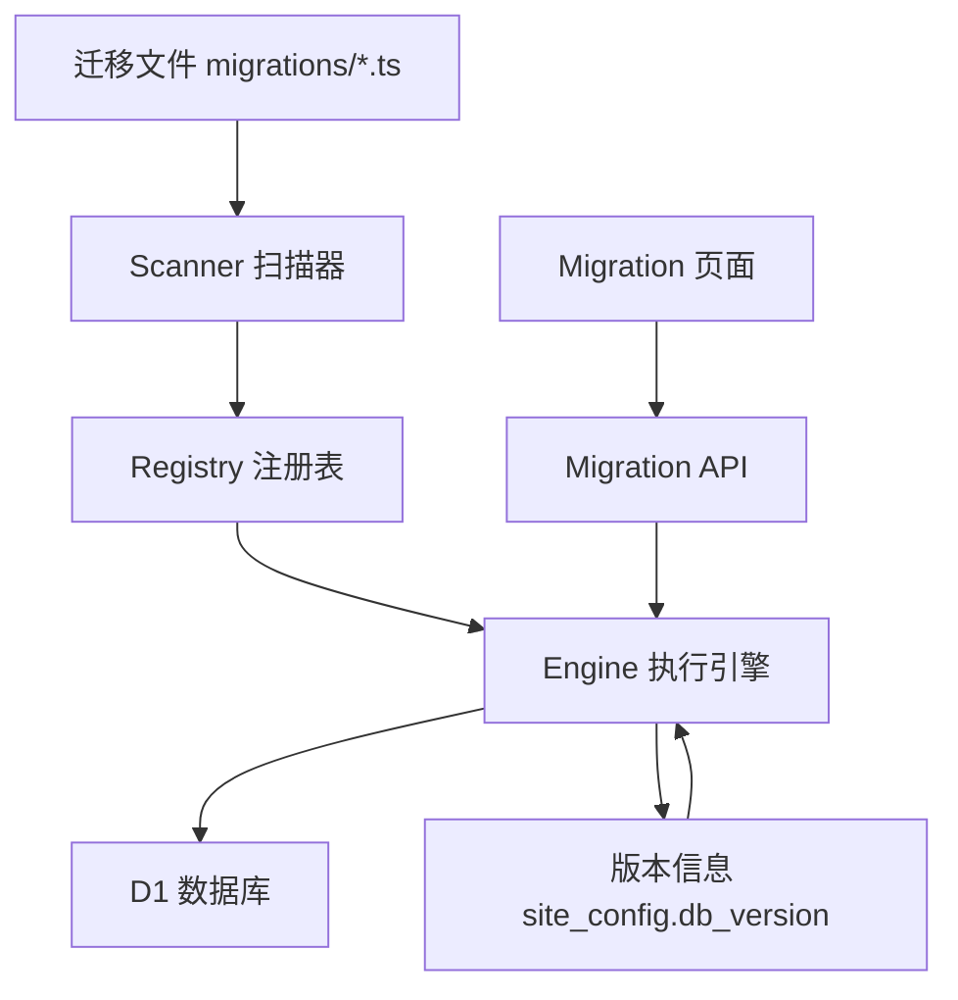
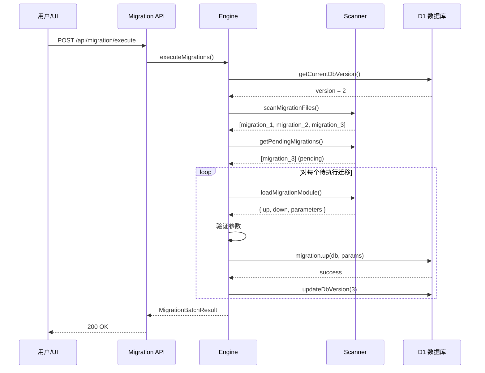

# 迁移系统

VOCArchive 使用自建的数据库迁移系统，而非 Drizzle Kit 的内置迁移功能。

## 为什么自建迁移系统

### Drizzle Kit 的限制

Drizzle Kit 提供了强大的迁移生成功能，但在 Cloudflare Workers 环境下有以下限制：

1. **生成的迁移无法在 Workers 中执行** - Drizzle Kit 生成的迁移依赖 Node.js 环境
2. **缺少运行时参数支持** - 无法在执行迁移时接收用户输入
3. **版本管理不灵活** - 没有内置的干运行、部分执行等功能

### 自建系统的优势

- ✅ 完全兼容 Cloudflare Workers 环境
- ✅ 支持参数化迁移（运行时输入配置）
- ✅ 干运行模式（预览变更）
- ✅ 版本管理和序列验证
- ✅ 回滚支持
- ✅ Web UI 管理界面

## 架构设计

### 核心组件



### 1. 迁移文件（Migration Files）

位置：`src/migrations/`

格式：`001_description.ts`, `002_description.ts`, ...

每个迁移文件必须export如下对象：

```typescript
export const version = 1;
export const description = '添加新配置项';

// 可选：参数定义
export const parameters = [
    {
        name: 'asset_url',
        type: 'url',
        description: '资源基础URL',
        required: true,
        validation: {
            pattern: '^https?://.+'
        }
    }
];

// 升级函数
export const up = async (db: DrizzleDB, params?) => {
    // 执行变更
};

// 回滚函数
export const down = async (db: DrizzleDB, params?) => {
    // 撤销变更
};
```

### 2. Scanner（扫描器）

文件：`src/app/db/utils/migration-scanner.ts`

**职责**：
- 扫描 `src/migrations/` 目录
- 加载迁移模块（动态 import）
- 验证迁移序列（版本号连续性）
- 检查参数需求
- 区分已应用/待执行的迁移

**关键函数**：

```typescript
// 扫描所有迁移文件
scanMigrationFiles(db: DrizzleDB): Promise<MigrationInfo[]>

// 获取待执行的迁移
getPendingMigrations(db: DrizzleDB): Promise<MigrationInfo[]>

// 验证迁移序列
validateMigrationSequence(migrations: MigrationInfo[]): ValidationResult

// 检查参数需求
checkBatchParameterRequirements(db: DrizzleDB, targetVersion?: number): Promise<BatchParameterRequirements>
```

### 3. Registry（注册表）

文件：`src/app/db/utils/migration-registry.ts`（自动生成）

**生成方式**：运行 `npm run build:migrations`

```typescript
// 自动生成的注册表
export const MIGRATION_REGISTRY = [
    {
        version: 1,
        fileName: '001_add_new_config.ts',
        description: '添加新配置项'
    },
    // ...
];
```

Scanner 使用 Registry 快速获取迁移列表，避免运行时的文件系统访问（Workers 不支持）。

### 4. Engine（执行引擎）

文件：`src/app/db/utils/migration-engine.ts`

**职责**：
- 执行单个或批量迁移
- 版本管理（读取/更新 `site_config.db_version`）
- 错误处理
- 回滚操作

**关键函数**：

```typescript
// 检查待执行迁移
checkPendingMigrations(db: DrizzleDB): Promise<MigrationSystemStatus>

// 执行单个迁移
executeMigration(db: DrizzleDB, migration: MigrationInfo, options?: ExecuteOptions): Promise<MigrationResult>

// 批量执行迁移
executeMigrations(db: DrizzleDB, options?: ExecuteOptions): Promise<MigrationBatchResult>

// 回滚到指定版本
rollbackToVersion(db: DrizzleDB, targetVersion: number): Promise<MigrationBatchResult>
```

## Feature

### 1. 参数化迁移

迁移可以在运行时接收用户输入的参数，适用于需要配置的场景。

**定义参数**：

```typescript
export const parameters: MigrationParameterDefinition[] = [
    {
        name: 'asset_url',
        type: 'url',
        description: '资源基础URL',
        required: true,
        validation: {
            pattern: '^https?://.+'
        }
    },
    {
        name: 'batch_size',
        type: 'number',
        description: '批处理大小',
        required: false,
        defaultValue: 50,
        validation: {
            min: 1,
            max: 1000
        }
    }
];
```

**使用参数**：

```typescript
export const up = async (db: DrizzleDB, params?: MigrationParameters) => {
    const assetUrl = params.asset_url as string;
    const batchSize = params.batch_size as number;

    await upsertSiteConfig(db, 'asset_url', assetUrl, '资源URL配置');
};
```

**API 调用**：

```http
POST /api/migration/execute
Content-Type: application/json

{
  "parameters": {
    "1": {
      "asset_url": "https://assets.example.com",
      "batch_size": 100
    }
  }
}
```

### 2. 干运行模式

预览迁移将执行的操作，不实际修改数据库。

```http
POST /api/migration/execute
{
  "dryRun": true
}
```

### 3. 版本管理

数据库版本存储在 `site_config` 表：

```sql
key: 'db_version'
value: '3'  -- 当前版本号
```

Scanner 比对当前版本和迁移文件版本，确定待执行的迁移。

### 4. 回滚支持

如果迁移实现了 `down` 函数，可以回滚到之前的版本：

```http
POST /api/migration/rollback
{
  "targetVersion": 2
}
```

引擎会按逆序执行迁移的 `down` 函数。

### 5. 序列验证

Scanner 自动验证迁移序列的完整性：
- 版本号必须连续（1, 2, 3, ...）
- 不允许版本号重复
- 不允许版本号跳跃

## 执行流程

### 正向迁移流程



### 回滚流程

回滚按逆序执行迁移的 `down` 函数，每次回滚后版本号 -1。

## API 端点

### 获取迁移状态

```http
GET /api/migration/status
```

响应：

```json
{
  "currentVersion": 2,
  "latestVersion": 5,
  "pendingCount": 3,
  "needsMigration": true,
  "migrations": [
    {
      "version": 1,
      "description": "初始配置",
      "status": "applied",
      "canExecute": true
    },
    {
      "version": 3,
      "description": "添加IPFS支持",
      "status": "pending",
      "canExecute": true,
      "parameters": [...]
    }
  ]
}
```

### 获取参数需求

```http
GET /api/migration/parameter-requirements?targetVersion=5
```

响应：

```json
{
  "hasUnmetRequirements": true,
  "missingParameters": [3, 5],
  "requirementsWithParameters": [
    {
      "version": 3,
      "parameters": [
        {
          "name": "asset_url",
          "type": "url",
          "required": true,
          "description": "资源URL"
        }
      ]
    }
  ]
}
```

### 执行迁移

```http
POST /api/migration/execute
Content-Type: application/json

{
  "targetVersion": 5,
  "dryRun": false,
  "force": false,
  "parameters": {
    "3": {
      "asset_url": "https://assets.example.com"
    }
  }
}
```

### 回滚迁移

```http
POST /api/migration/rollback
{
  "targetVersion": 2
}
```

## Web UI 管理界面

访问 `/migration` 查看迁移管理界面（或在管理页面`/admin`下点击`迁移(Migration)`Tab）。

**功能**：
- 查看迁移列表和状态
- 查看参数需求
- 输入参数并执行迁移
- 查看执行结果

## 编写迁移

### 1. 修改 Schema

编辑 `src/app/db/schema.ts`：

```typescript
export const siteConfig = sqliteTable('site_config', {
    key: text('key').primaryKey(),
    value: text('value').notNull(),
    description: text('description'),
    // 新增字段
    category: text('category')
});
```

### 2. 生成参考迁移（可选）

```bash
npm run db:generate
```

这会在 `migrations/` 目录生成 Drizzle Kit 的迁移 SQL，作为参考。

### 3. 创建迁移文件

在 `src/migrations/` 创建 `003_add_config_category.ts`：

```typescript
import type { DrizzleDB } from '../app/db/client';

export const version = 3;
export const description = '为配置项添加分类字段';

export const up = async (db: DrizzleDB) => {
    // 添加新列（SQLite 不支持直接 ALTER，需要重建表）
    await db.run(`
        ALTER TABLE site_config ADD COLUMN category TEXT;
    `);
};

export const down = async (db: DrizzleDB) => {
    // 回滚时移除列
    await db.run(`
        ALTER TABLE site_config DROP COLUMN category;
    `);
};
```

### 4. 生成注册表

```bash
npm run build:migrations
```

这会更新 `src/app/db/utils/migration-registry.ts`。

### 5. 执行迁移

访问 Web UI 或调用 API 执行迁移。

## 最佳实践

- **幂等性**：迁移应该能够重复执行而不出错
- **原子性**：一个迁移完成一个逻辑变更
- **可回滚**：尽量实现 `down` 函数
- **测试**：在开发环境测试迁移和回滚
- **文档化**：在 `description` 中清晰描述变更

## 注意事项

- 迁移文件一旦部署就不应修改，需要新建迁移文件
- D1 数据库的事务支持有限，谨慎使用
- SQLite 的 `ALTER TABLE` 功能受限，复杂变更需要重建表
