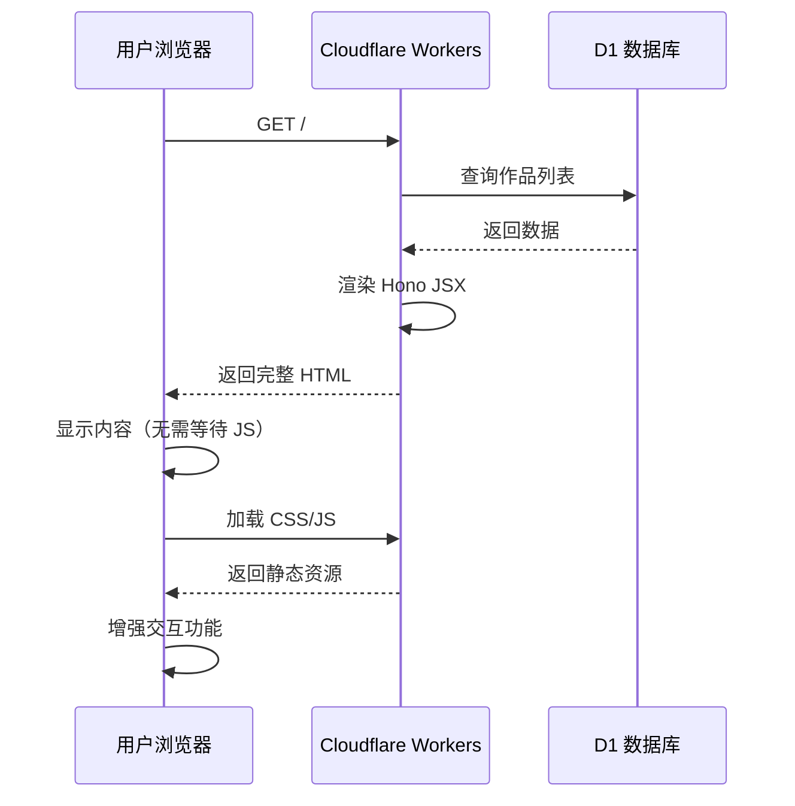

# SSR 与 Service Worker

## 服务端渲染（SSR）

### 为什么使用 SSR

在 Cloudflare Workers、大陆网络 环境下，SSR 相比纯客户端渲染有明显优势：

- ✅ **加载快** - HTML 在边缘节点直接渲染，无需等待 JavaScript 进一步 Fetch
- ✅ **SEO 友好** - 搜索引擎可以直接索引内容
- ✅ **低配设备友好** - 减少客户端 JavaScript 执行
- ✅ **网络容错** - 即使 JavaScript 加载失败，内容仍可见

### Hono JSX

VOCArchive 使用 Hono 框架内置的 JSX 支持，而非 React。

**路由集成**：

```typescript
// src/app/index.tsx

app.get('/', async (c) => {
    const db = createDrizzleClient(c.env.DB);
    const works = await getWorkListWithPagination(db, 1, 10);
    const totalCount = await getTotalWorkCount(db);

    return c.html(<IndexPage works={works} totalCount={totalCount} currentPage={1} />);
});
```

### 组件结构

**布局组件**：

```typescript
// src/app/pages/layouts/base-layout.tsx

export const BaseLayout = (props: { children: JSX.Element, title?: string }) => {
    return (
        <html>
            <head>
                <title>{props.title || 'VOCArchive'}</title>
                <link rel="stylesheet" href="/css/common.css" />
            </head>
            <body>
                <header>
                    <nav>{/* 导航栏 */}</nav>
                </header>
                <main>{props.children}</main>
                <Footer />
            </body>
        </html>
    );
};
```

**复用组件**：

```typescript
// src/app/pages/components/work-list.tsx

export const WorkList = (props: { works: Work[] }) => {
    return (
        <div class="work-list">
            {props.works.map(work => (
                <WorkCard work={work} />
            ))}
        </div>
    );
};
```

### 客户端脚本注入

虽然主要内容是 SSR，但仍需要客户端交互脚本。

**内联脚本**：

```typescript
export const IndexPage = (props) => {
    return (
        <html>
            <body>
                {/* SSR 内容 */}
                <script dangerouslySetInnerHTML={{
                    __html: `
                        // 客户端交互逻辑
                        document.getElementById('search-button').addEventListener('click', () => {
                            // 搜索逻辑
                        });
                    `
                }} />
            </body>
        </html>
    );
};
```

**外部脚本**：

```typescript
<script src="/admin/js/main.js" type="module"></script>
```

### SSR 数据流



## Service Worker

VOCArchive 使用 Service Worker 实现离线缓存和资源管理。

**注册**：

```javascript
// public/sw-register.js

if ('serviceWorker' in navigator) {
    navigator.serviceWorker.register('/sw.js')
        .then(registration => {
            console.log('Service Worker 注册成功:', registration);
        })
        .catch(error => {
            console.error('Service Worker 注册失败:', error);
        });
}
```

**Service Worker 结构**：

```javascript
// public/sw.js

const SW_VERSION = 'v2.7.0';
const CACHE_NAME = 'vocarchive-cache-v2';

// 安装事件
self.addEventListener('install', (event) => {
    console.log('[SW] 安装 Service Worker', SW_VERSION);
    event.waitUntil(self.skipWaiting());
});

// 激活事件
self.addEventListener('activate', (event) => {
    console.log('[SW] 激活 Service Worker');
    event.waitUntil(self.clients.claim());
});

// 拦截请求
self.addEventListener('fetch', (event) => {
    event.respondWith(handleFetch(event.request));
});
```

### 缓存策略

VOCArchive 根据资源类型采用不同缓存策略。

**1. Cache First（缓存优先）**

适用于：CSS、JS、字体等静态资源

```javascript
async function cacheFirst(request) {
    const cache = await caches.open(CACHE_NAME);
    const cached = await cache.match(request);

    if (cached) {
        console.log('[SW] 缓存命中:', request.url);
        return cached;
    }

    console.log('[SW] 缓存未命中，请求网络:', request.url);
    const response = await fetch(request);

    // 缓存响应
    if (response.ok) {
        cache.put(request, response.clone());
    }

    return response;
}
```

**2. Network First（网络优先）**

适用于：API 请求、动态内容

```javascript
async function networkFirst(request) {
    try {
        const response = await fetch(request);

        // 缓存成功的响应
        if (response.ok) {
            const cache = await caches.open(CACHE_NAME);
            cache.put(request, response.clone());
        }

        return response;
    } catch (error) {
        // 网络失败时使用缓存
        const cache = await caches.open(CACHE_NAME);
        const cached = await cache.match(request);

        if (cached) {
            console.log('[SW] 网络失败，使用缓存:', request.url);
            return cached;
        }

        throw error;
    }
}
```

**3. Stale While Revalidate（后台更新）**

适用于：作品列表、图片等可以稍微过期的资源

```javascript
async function staleWhileRevalidate(request) {
    const cache = await caches.open(CACHE_NAME);
    const cached = await cache.match(request);

    // 立即返回缓存（如果有）
    const fetchPromise = fetch(request).then(response => {
        if (response.ok) {
            cache.put(request, response.clone());
        }
        return response;
    });

    return cached || fetchPromise;
}
```

### 外部资源缓存

VOCArchive 支持缓存外部资源。

```javascript
// sw-config.js

self.EXTERNAL_HOSTS = [
    'cloudflare-ipfs.com',
    'ipfs.io',
    'assets.vocarchive.com'
];

// sw.js

function isExternalHost(url) {
    return self.EXTERNAL_HOSTS.some(host => url.includes(host));
}

async function handleFetch(request) {
    const url = request.url;

    // 外部资源使用 Cache First
    if (isExternalHost(url)) {
        return cacheFirst(request);
    }

    // API 请求使用 Network First
    if (url.includes('/api/')) {
        return networkFirst(request);
    }

    // 静态资源使用 Stale While Revalidate
    return staleWhileRevalidate(request);
}
```

### 缓存管理

**缓存大小限制**：

```javascript
const MAX_CACHE_SIZE = 100 * 1024 * 1024; // 100 MB

async function manageCacheSize() {
    const cache = await caches.open(CACHE_NAME);
    const keys = await cache.keys();

    let totalSize = 0;
    const entries = [];

    for (const request of keys) {
        const response = await cache.match(request);
        const blob = await response.blob();
        totalSize += blob.size;

        entries.push({
            url: request.url,
            size: blob.size,
            date: new Date(response.headers.get('date'))
        });
    }

    // 超出限制时，删除最旧的条目
    if (totalSize > MAX_CACHE_SIZE) {
        entries.sort((a, b) => a.date - b.date);

        for (const entry of entries) {
            await cache.delete(entry.url);
            totalSize -= entry.size;

            if (totalSize <= MAX_CACHE_SIZE * 0.9) break;
        }
    }
}
```

**手动清理缓存**：

```javascript
// 客户端调用
navigator.serviceWorker.controller.postMessage({
    type: 'clear_cache'
});

// Service Worker 处理
self.addEventListener('message', async (event) => {
    if (event.data.type === 'clear_cache') {
        const cacheNames = await caches.keys();
        await Promise.all(cacheNames.map(name => caches.delete(name)));
        console.log('[SW] 缓存已清理');
    }
});
```

## Workers 环境限制

### 不支持的 Node.js API

Cloudflare Workers 不是 Node.js 环境，许多 API 不可用：

- ❌ `fs` - 文件系统
- ❌ `path` - 路径操作（可用 `pathe` 替代）
- ❌ `crypto` - 部分功能不支持（可用 Web Crypto API）
- ❌ `process` - 进程相关

### 兼容性标志

在 `wrangler.toml` 启用 `nodejs_compat`：

```toml
compatibility_flags = ["nodejs_compat"]
```

这提供了部分 Node.js API 的兼容层，但功能有限。

### CPU Time 限制

Workers 请求有 CPU 时间限制（通常 50ms）：

- 复杂查询需要优化
- 避免长时间循环
- 使用索引加速查询

## 性能优化

### 1. 边缘缓存

利用 Cloudflare CDN 缓存静态资源
```toml
# wrangler.toml
assets = { directory = "./public" }
```

### 2. 数据库查询优化

```typescript
// ❌ N+1 查询
for (const work of works) {
    work.creators = await getCreatorsByWorkId(db, work.id);
}

// ✅ 批量查询
const workIds = works.map(w => w.id);
const allCreators = await getCreatorsByWorkIds(db, workIds);
```

### 3. 响应压缩

Workers 自动压缩响应（Gzip/Brotli）。

## 未来改进

- 考虑引入 Islands Architecture（如 Astro）
- 支持更细粒度的 SSR/CSR 混合
- 优化 Service Worker 缓存策略
- 支持 Offline First 模式
