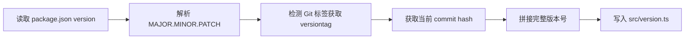
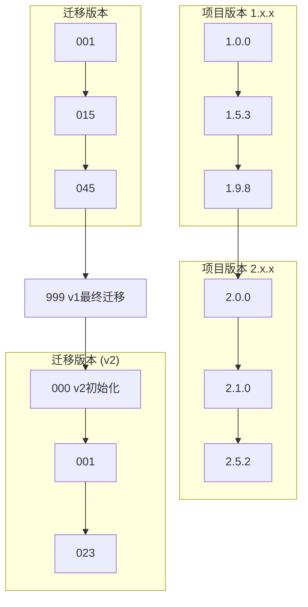

# 版本号机制

VOCArchive 采用双重版本号系统,分别管理项目版本和数据库迁移版本。

## 概述

为了在持续开发和数据库演进中保持清晰的版本追踪,VOCArchive 实现了两套独立但相互协调的版本号系统:

- **项目版本号**: 标识应用程序的发布版本,遵循 Semver 变体格式
- **迁移版本号**: 标识数据库 Schema 的演进版本,使用三位数字格式

这两套系统在 MAJOR 版本变更时同步重置,保持版本对齐。

## 项目版本号

### 格式规范

项目版本号采用 [Semantic Versioning](https://semver.org/) 的变体格式:

```
MAJOR.MINOR.PATCH-versiontag.num-commithash
```

**组成部分**:
- `MAJOR`: 主版本号,重大架构变更或不兼容更新
- `MINOR`: 次版本号,新功能添加(向后兼容)
- `PATCH`: 修订版本号,问题修复和小改进
- `versiontag`: 版本标签(如 `alpha`, `beta`, `rc`)
- `num`: 标签序号
- `commithash`: Git commit hash 的前 8 位

**示例**:
```
1.2.3-beta.5-a1b2c3d4
```

### 版本号重置规则

- **MAJOR 变更时**: `MINOR` 和 `PATCH` 归零
  ```
  1.5.7 → 2.0.0
  ```

- **MINOR 变更时**: `PATCH` 归零
  ```
  1.5.7 → 1.6.0
  ```

- **PATCH 变更时**: 仅递增 `PATCH`
  ```
  1.5.7 → 1.5.8
  ```

### VersionTag 规则

除去存在任何未commit更改与当前commit无Tag时时强制使用 **alpha** 的场景以外，其余 VersionTag 规则均按照 Git Tag 填写内容自动生成:

- **alpha**: 预览版本,包含未完成的功能或已知问题
- **beta**: 测试版本,包含大部分功能,但可能存在一些问题
- **rc**: 候选版本,功能完整,问题较少,准备发布
- **stable**: 稳定版本,功能完整,问题已修复,适合生产环境

### 自动生成机制

项目版本号由构建脚本自动生成,无需手动维护:

```bash
# 版本号生成脚本
npm run version:generate
```

**生成流程**:



**生成的代码**:

```typescript
// src/version.ts (自动生成)
export const VERSION = '1.2.3-beta.5-a1b2c3d4';
export const MAJOR = 1;
export const MINOR = 2;
export const PATCH = 3;
export const COMMIT = 'a1b2c3d4';
```

## 迁移版本号

### 格式规范

迁移版本号使用三位数字格式,与 [迁移系统](./migration-system.md) 配合使用:

```
XXX
```

- 取值范围: `000` - `999`
- 迁移文件命名: `XXX_description.ts`

**示例**:
```
001_initial_setup.ts
002_add_ipfs_support.ts
015_refactor_external_storage.ts
```

### 重置规则

迁移版本号在 **项目 MAJOR 版本变更** 时重置为 `000`:

| 项目版本 | 迁移版本范围 |
|---------|-------------|
| 1.x.x   | 001 - 045   |
| 2.x.x   | 001 - 023   |
| 3.x.x   | 001 - 012   |

**原因**: MAJOR 版本变更通常意味着数据库架构的重大重构,重置迁移版本号可以:
- 清晰标记架构代际
- 避免迁移文件数量膨胀
- 简化版本追踪

### 特殊版本号

#### `000` - 初始化脚本

`000` 统一用于数据库初始化:

```typescript
// src/migrations/000_init.ts
export const version = 0;
export const description = '数据库初始化';

export const up = async (db: DrizzleDB) => {
    // 创建所有基础表
    await db.run(initSQL);
};
```

**特点**:
- 每个 MAJOR 版本都有独立的 `000_init.ts`
- 包含该 MAJOR 版本的完整 Schema
- 仅在全新部署时执行

#### `999` - MAJOR 版本终结

`999` 统一标记为上一个 MAJOR 版本的最后一个迁移:

```typescript
// src/migrations/999_v1_final.ts
export const version = 999;
export const description = 'v1.x 最终迁移,准备升级到 v2.0';

export const up = async (db: DrizzleDB) => {
    // 执行 v1 到 v2 的迁移准备工作
    await db.run(migrationPrepSQL);
};
```

**用途**:
- 数据迁移和格式转换
- 版本间兼容性桥接
- 清理废弃数据

## 版本号对应关系

### 版本同步

项目版本和迁移版本在 MAJOR 版本上保持同步:



### 版本追踪

数据库当前迁移版本存储在 `site_config` 表:

```sql
SELECT value FROM site_config WHERE key = 'db_version';
-- 返回: '15'
```

结合项目版本,完整的版本信息为:

```
项目版本: 1.5.3-rc.2-a1b2c3d4
数据库版本: 015
```

### 版本兼容性

**向前兼容**:
- 同一 MAJOR 版本内,数据库版本可以低于代码版本
- 启动时自动检测并提示执行待处理的迁移

**向后不兼容**:
- 代码版本不能低于数据库版本
- 需要回滚数据库或升级代码

## 版本号使用场景

### 1. 发布管理

发布新版本时,Git 标签与项目版本对应:

```bash
# 发布 v1.5.0
git tag v1.5.0-rc.1
git push --tags

# 构建时自动生成版本号
npm run build
# 生成: 1.5.0-rc.1-a1b2c3d4
```

### 2. 迁移执行

执行数据库迁移时,迁移系统根据版本号顺序执行:

```http
GET /api/migration/status

Response:
{
  "currentVersion": 12,
  "latestVersion": 15,
  "projectVersion": "1.5.3-a1b2c3d4",
  "pendingMigrations": [13, 14, 15]
}
```

## 最佳实践

### 版本号管理

1. **不要手动修改版本号** - 依赖自动生成脚本
2. **Git 标签规范命名** - 使用 `vX.Y.Z-tag.N` 格式
3. **MAJOR 升级前规划** - 提前设计迁移路径

### 迁移版本号管理

1. **按顺序分配** - 从 `001` 开始递增
2. **不要跳号** - 保持迁移序列连续性
3. **MAJOR 升级时归零** - 创建新的 `000_init.ts`
4. **预留 `999`** - 用于 MAJOR 版本终结迁移

### 版本兼容性

1. **前向兼容优先** - 新版本代码兼容旧数据库
2. **渐进式迁移** - 避免一次性大规模改动
