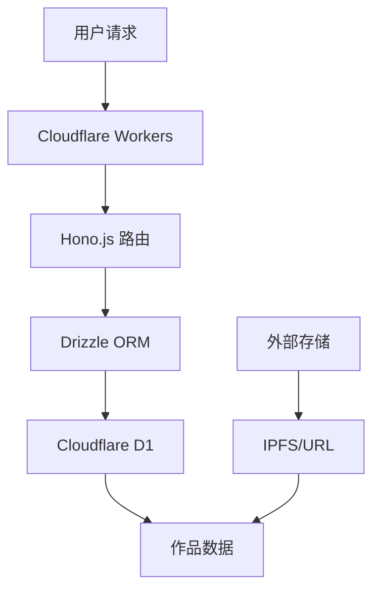

## 快速预览

### 核心功能

**作品管理** - 支持音乐、图片、歌词等多媒体资产
```http
GET /api/list/work/1/10
POST /api/input/work
```

**创作者系统** - 人类/虚拟创作者分类管理
```http
GET /api/list/creator/1/10
POST /api/input/creator
```

**标签分类** - 层级分类与自由标签双重组织
```http
GET /api/list/tags-with-counts
GET /api/list/works-by-tag/{uuid}/1/10
```

### 技术架构



### 数据模型

- **19 个数据表** - 完整的实体关系设计
- **UUID 业务主键** - 便于分布式环境使用
- **多语言支持** - 作品标题国际化
- **外键约束** - 确保数据完整性

## 开始使用

1. **克隆仓库**
   ```bash
   git clone https://github.com/gxxk-dev/VOCArchive.git
   ```

2. **安装依赖**
   ```bash
   npm i
   ```

3. **配置数据库**
   ```bash
   wrangler d1 create vocarchive-dev
   # 在 wrangler.toml 填入你的数据库uuid
   ```

4. **启动开发**
   ```bash
   npm run dev
   ```

---

<div style="text-align: center; margin-top: 2rem; color: #666; font-size: 0.9em;">
  此文档技术参照版本： <code>commit 41ac5455b9753c9bbbf791e03feae0f68248d61f(branch main)</code>
</div>
